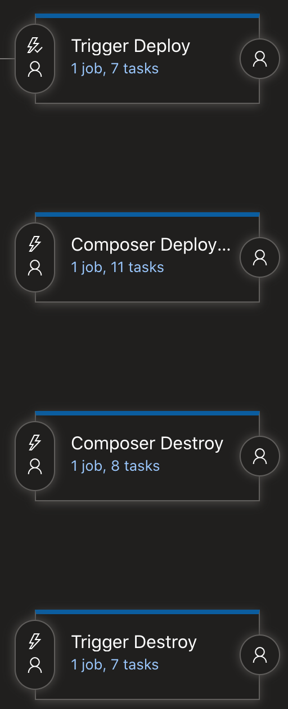

# Introduction
The propose is this code is to offer teams a simple way for scheduling their releases using GCP. The idea is to add it as first stage of our pipeline for the deploy and to the last stage for the destroy.

The flow for the deploy of the infrastructure is the following: A previously deployed (on the new stage) cloud function will call Azure DevOps that will create the all the required infrastructure. The trigger of the function would be a Pub/Sub topic. A cloud scheduler will write a message into the topic to start the execution.

Also, we offer the possibility of create a logic inside the cloud function to create a more complex trigger.


# Functionality
We find two different codes:
#### 1. Cloud function
The cloud function get makes the call to Azure DevOps top execute the pipeline. It also decode the user and password to keep security.
#### 2. Terraform
Terraform script that deploy all necessary components invoke the deploy. This components are:
* Cloud Function: *Decrypt necessary passwords and call Azure DevOps to deploy the required infrastructure*


# Cloud function code
The cloud function code has only two files:
* requirements.txt: *Contains all the Python packages required so they can be installed in the Cloud Function*

* main.py: *Main class, contains the entry point method for the process. The entry point name will be defined as a variable on the Azure Pipeline. Also two more methods __decrypt_from_bucket__ to get the password and user from KMS and __apply_logic__ that can add a more complex logic to the trigger even using more than one event*

# Infrastructure Code
Trigger release stage is deployed using the standard CIO approach, by applying  customized CCS Terraform scripts.

* variables.tf: *Contains all Terraform input variables required for the deployment of all the infrastructure*

* terraform.tfvars: *Terraform variable definition file, contains all the Terraform variables with their values, the values are defined on deployment time using AzureDevOps tasks (Tokenized)*

* main.tf: *Terraform configuration file, contains the definition of all the infrastructure required*
    ```
    Provider Google
    Provider Google-Beta
    Setup Project Reference
    Setup Terraform State folder (store plan files)
    Module GCP storage
    Module Transfer Pub/Sub
    Module Google Cloud Function
    Module Google Cloud Scheduler Job Pub/Sub
    ```

# Pipeline
We have to add one artefact that is a git repository were the code (Terraform and cloudFunction are contained). This git will be downloaded into the temporal AzureDevOps agent responsible of the  deploying the infrastructure.

This git contains two separate code folders, one for deploying the infrastructure (Terraform scripts) and another one for the monitoring code (Python).

    ```
    65343-aia-release-trigger
        cloudFunction
        terraform
    ```


## Variables

This are the requested variables for the Trigger Release Destroy:
- GCP_PROJECT_CREDENTIAL_FILE_PATH
- GCP_PROJECT_ID
- GCP_PROJECT_REGION
- GCP_PROJECT_ZONE
- GCP_PROJECT_VPC
- GCP_OPERATION_SA_NAME
- GCP_BUCKET_NAME_TRIGGER
- TRIGGER_TOPIC_NAME
- GCP_CS_DESCRIPTION
- GCP_CS_SCHEDULE
- GCP_CS_TIMEZONE
- GCP_CS_PAYLOAD
- KEY_RING
- KMS_REGION
- KEY_ID
- KMS_PROJECT_ID
- KMS_BUCKET
- TRIGGER_FUNCTION_ENTRYPOINT
- TRIGGER_FUNCTION_NAME
- SYSTEM_COLLECTIONURI
- SYSTEM_TEAMPROJECT
- BUILD_PROJECTNAME
- RELEASE_RELEASEID
- RELEASE_ENVIRONMENTID
- TF_STATE_FILES_BUCKET
>*Please note, some of them can be shared with the infrastructure terraform script. Also, other variables are generated by Azure DevOps so it's not necessary than we define them again*

## Stages
This functionality has also two stages __Deploy__ and __Destroy__. Both needs to be executed manually on demand. Deploy stage should nby added as first stage of the pipeline while destroy should be set at the last stage as we can see on the following image:



By the moment we are using as machine four our pipelines __Azure Pipelines Ubuntu 16.04__ maybe in a future this will be changed for an image managed by *Enterprise Architecture*.

We are not going to deeply see both stages as steps are pretty similar to other pipelines so we will see just the functionality.

### Deploy
Will be the first stage of the pipeline. It will be triggered manually and will just create just the infrastructure needed by the trigger(Topic, cloudFunction and Scheduler). It also will upload the Azure user and token to a KMS project.


### Destroy
Will be the last stage of the release. It will destroy the infrastructure required for the trigger. If the infrastructure for the process of the pipeline hasn't been destroyed before it will be keep.
